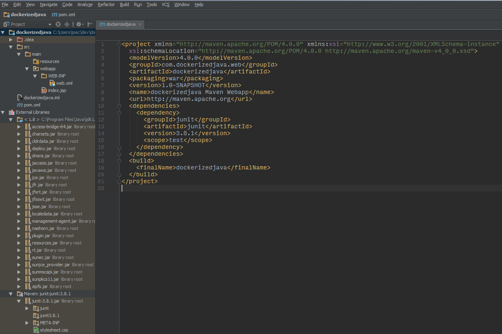

# DockerizedJava
[](https://microbadger.com/images/joeco/dockerizedjava "Get your own image badge on microbadger.com")

### Video presentation of this tutorial is here:
[Youtube talk](https://youtu.be/jRpevXqlSk4)

## How to setup a webapp project with Java, Maven, Tomcat and DEPLOY with Docker
### What's the purpose of this repo?
- Java is not only a popular software development tool, but an entire ecosystem
    - Used in a vast array of applications and industries (gmail, high frequency trading, government sector, etc.)
- Complete end-to-end example from development to production
    - Replicable pattern to help you get your own production pipeline in place
    - Rapidly scaffold & ship code, so you can more quickly get product in front of users, gain feedback and iterate
    - A proven, stable, reliable setup lets you can skip the hassles
- By the end of the demo, you have a complete, end-to-end, 'solution-in-a-box', infinitely extensible
    - You may want to develop classes, add database, 'business logic' etc., but the main footprint is solid

### Trial run
Do a trial run of the finished Docker image version of this app (pulled via Dockerhub), as a sample of how the final product works.
```
docker login
docker run -d --name javadocker -p 80:8080 joeco/dockerizedjava
curl $(docker-machine ip)
curl $(docker-machine ip)/simple
```

### Alternatives / Other resources

- [How to Create .war Files with IntelliJ and Deploy to Tomcat](http://geekabyte.blogspot.com/2015/07/how-to-create-war-files-with-intellij.html)
- [Packaging and serving your Java application with Docker](http://geekyplatypus.com/packaging-and-serving-your-java-application-with-docker/)
- [How to create a Web Application Project with Java, Maven, Jetty](https://www.javacodegeeks.com/2015/08/how-to-create-a-web-application-project-with-java-maven-jetty.html)
- [Building a Web App with Java Servlets](https://www.sitepoint.com/tutorial-building-web-app-with-java-servlets/)

### Agenda / Table of contents
- Install pre-requisites
    - Before you start, make sure that the following software are installed on your computer:
        - IntelliJ IDEA ULTIMATE Edition. [Buy & Install IDEA](https://www.jetbrains.com/idea/)
        - Command shell program (e.g. ConEmu)
        - Java SE Development Kit (JDK), version 6 or later. [Download Oracle JDK](http://www.oracle.com/technetwork/java/javase/downloads/index.html)
        - Tomcat Server, version 7 or later. [Download Tomcat](https://tomcat.apache.org/) and follow installation instructions
        - Maven, version 3 or later. [Download Maven](https://maven.apache.org/) and follow installation instruction
        - Docker. [Download Docker](https://www.docker.com/) (Windows 10+ or MacOS users will use CE, whereas on Windows 7 use 'Docker Toolbox')
        - A web browser
- [Create Java webapp w/ IDEA & Maven (several ways)](#create-project)
- [Explore the project](#explore-project)
- [Create / edit files](#create-edit) (Add a Java class & misc files to enable two webapp views)
- [Setup Tomcat server](#setup-tomcat) (compile & run using exploded WAR Files for development)
- [Setup SSL](#setup-sll)
- [Package with Maven for production](#package-production)
- [Build and run app within Tomcat within a deployable Docker image](#build-run-docker)

### Creating a project <a id="create-project"></a>

There are several ways to create a new Java project with Maven...

#### Main way

1. Open action menu (Control+Shift+A) and type 'Create new Project' 
2. The New Project wizard opens
3. In the left-hand pane, select Maven (i.e. 'basic' Maven usage w/ GUI)
4. If the JDK that you want to use is already defined in IntelliJ IDEA, select that JDK from the Project SDK list and proceed to the next step
5. Otherwise, click New, select JDK, and select the JDK installation folder in the dialog that opens
6. Check the 'Create from archetype' checkbox
7. Select the archetype 'maven-archetype-webapp'
8. Fill in the GroupId, Artifactid, and Version
9. Click Next
10. Ensure maven is properly configured
11. Click Next
12. Give the project a name and the project location ('dockerizedjava')
13. Click Finish and wait while IntelliJ IDEA is creating the project

#### Alternate ways

> For more practice, try out these alternate ways of creating new projects:

1. Do the same steps as above, but do not use an archetype
    - i.e. skip over steps #6 and #7, #11 and 12
    - This will create a blank, bare-bones Java/Maven project
2. Create project with Maven but using the command line (i.e. 'advanced' Maven usage w/ CLI)...
    - Use the following in the command line:
    ```
    mvn archetype:generate
        -DgroupId=com.temp.testing
        -DartifactId=JerseyWebapp
        -DarchetypeGroupId=org.glassfish.jersey.archetypes
        -DarchetypeArtifactId=jersey-quickstart-webapp
        -DinteractiveMode=false
    ```
    - In IDEA: (Control+Shift+A) and type 'Open...'
        - Pick the new folder you just created via the "DartifactId" option above (i.e. 'JerseyWebapp'), as the project to open
    - Add the jetty plugin to pom.xml:
    ```
      <plugin>
        <groupId>org.mortbay.jetty</groupId>
        <artifactId>maven-jetty-plugin</artifactId>
        <version>6.1.26</version>
        <configuration>
          <connectors>
            <connector implementation="org.mortbay.jetty.nio.SelectChannelConnector">
              <port>8080</port>
            </connector>
          </connectors>
        </configuration>
      </plugin>
    ```
    - `cd JerseyWebapp`
    - `mvn jetty:run`
    - [Open in browser to check](http://localhost:8080/JerseyWebapp/)

### Exploring the project structure <a id="explore-project"></a>
Once the project is created using the method you prefer, you'll see something similar to this in the Project tool window


### Create / Edit source files, add a servlet class, etc. <a id="create-edit"></a>
1. Adjust pom.xml
    - The pom.xml should look like the one in the project. You can also overwrite pom.xml using the one from this project.
2. `cd dockerizedjava`
3. `mkdir -p src/main/java/com/dockerizedjava/web`
4. Right click 'java' in Project window and mark as 'sources root'
5. Add a new file...
    - With the package folder ('com.dockerizedjava.web') selected in the Project window...
    - (press Alt+insert -> pick Java Class -> name it "SimpleServlet")
6. Paste the contents of the `SimpleServlet.java` file provided
    - Our SimpleServlet class is just that: a servlet that prints a simple message to the response’s Writer.
7. Change web.xml to add this servlet to your web application and map it to a request path.
    - You can change web.xml in src/main/webapp/WEB-INF

> Tip: On your own, try developing more extensive functionality, connect a database (e.g. PostgreSQL, MongoDB, etc), build more classes etc., use frameworks such as Spring or Struts

#### Run with Jetty server for quick testing
1. `mvn jetty:run`
2. [Open in browser to check](http://localhost:8080/dockerizedjava/)

### Setup Tomcat Server <a id="setup-tomcat"></a>
1. 'Edit configurations...'
2. Add a Tomcat (local) server
3. Add an artifact (of type 'WAR (web application archive) exploded')
4. Run the server with the green 'play' button to test

### Setup SSL / HTTPS <a id="setup-ssl"></a>
1. Run command to create a keystore
    ```
    keytool -genkey -alias jetty6 -keyalg RSA
      -keystore target/jetty-ssl.keystore
      -storepass password -keypass password
      -dname "CN=your name"
    ```
2. Uncomment the commented connector node in pom.xml to define SSL on port 8081
3. Open server.xml from your system's installed Tomcat directory, under 'conf', and edit it to include an SSL Connector node (May need to use an editor with admin privileges)
    ```
        <Connector port="8081" protocol="org.apache.coyote.http11.Http11NioProtocol"
                   SSLEnabled="true"
                   maxThreads="150" scheme="https" secure="true"
                   clientAuth="false"
                   sslProtocol="TLS"
                   keystoreFile=" path to your project directory \target\jetty-ssl.keystore"
                   keystoreType="JKS"
                   keystorePass="password"
                   keyPass="password" />
    ```               
4. Add '8081' to the HTTPs port setting in 'edit configurations...'
5. Run the server again by pressing the green 'play' button to test

### Package the app into a WAR file for production, using Maven Integration <a id="package-production"></a>

When you get to the stage when you are happy with your application, place it in a WAR file to be used later by Docker and Tomcat. You can use the Maven integration from within the IDE to do this

1. On the right side, make sure the maven project pane is on view, then expand the lifecycle node, select 'package', and press enter (or double click on 'package')
2. Maven will compile, build and package the project into a war file in the 'target' directory inside your projects directory. The pane that shows at the bottom of the IDE when you run the package provides more information
3. Check the 'target' directory after you have clicked 'package', to ensure the .war file appeared there

### Build Docker Image and Run as a container with Compose <a id="build-run-docker"></a>
- Add the following Tomcat- and Docker-related files from this repo, into the root project directory
    - manager.xml, tomcat-user.xml, Dockerfile and docker-compose.yml

- `COMPOSE_CONVERT_WINDOWS_PATHS=1 docker-compose up -d`
- Test with the same curl command from above:
    ```
    curl $(docker-machine ip)
    curl $(docker-machine ip)/simple
    ```